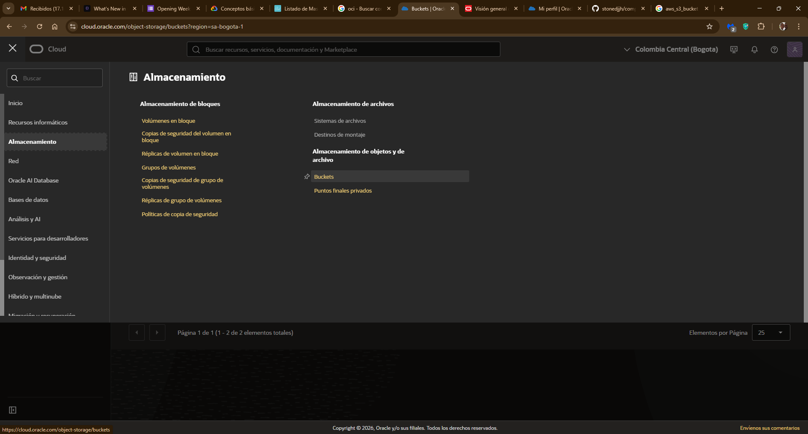
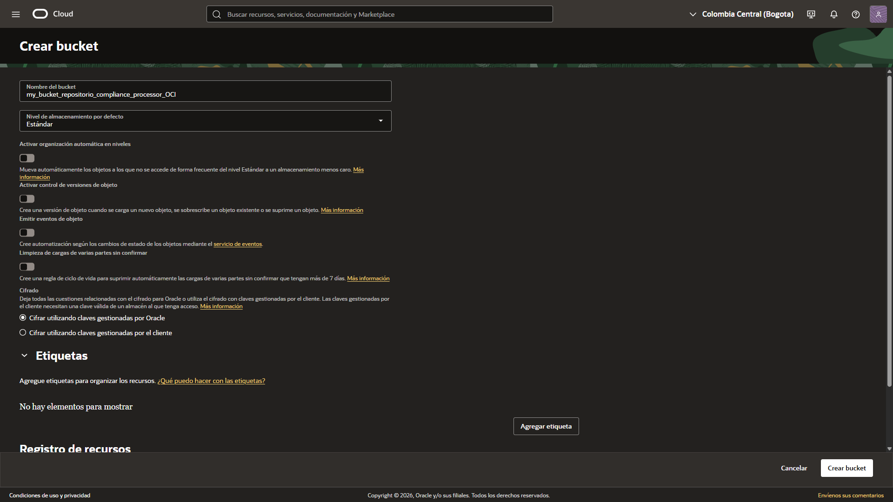
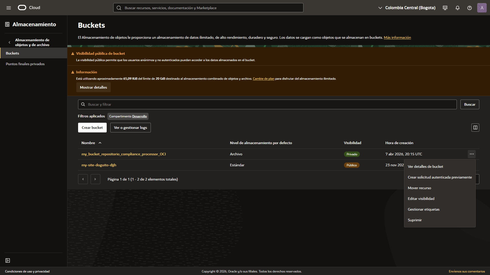
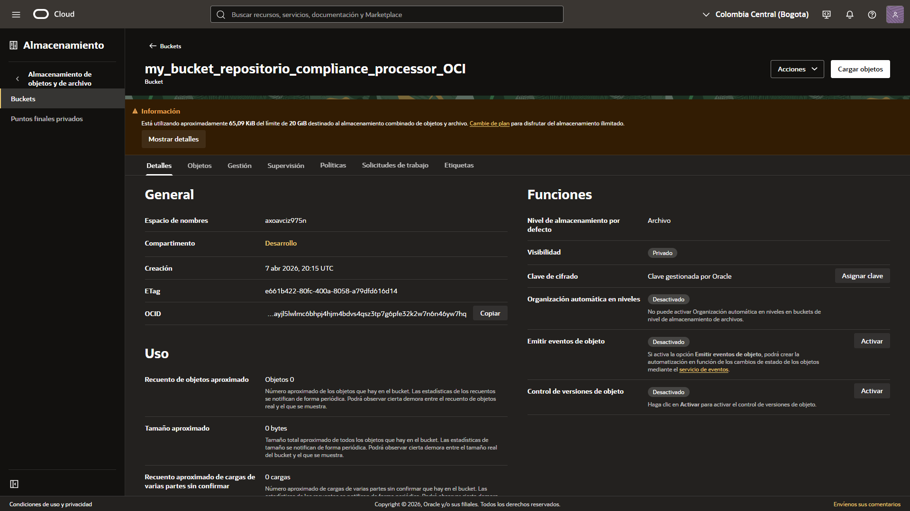

# Creación de un bucket en OCI

1. Navegación Inicial

En la consola de OCI, acceder a:

**Menú (Toggled) > Almacenamiento > Almacenamiento de objetos y de archivo > Buckets**



2. Creación del Recurso



Hacer clic en el botón `Crear bucket` y configurar los siguientes parámetros:

- **Nombre del Bucket:** Identificador único para el recurso.

- **Nivel de almacenamiento:** Seleccionar Estándar para acceso frecuente (baja latencia).

- **Organización automática de niveles:** Equivalente al Intelligent Tiering de AWS; optimiza costos moviendo objetos según su frecuencia de uso.

- **Control de versiones:** Permite mantener un historial de cambios en los objetos, evitando pérdidas accidentales.

- **Emitir eventos de objeto:** Permite integrar flujos de trabajo basados en eventos (similar a Amazon EventBridge).

- **Limpieza de cargas:** Gestiona automáticamente la eliminación de subidas fallidas o incompletas para ahorrar espacio.

3. Seguridad y Cifrado

> [!IMPORTANT]
> El cifrado es obligatorio. Se puede optar por claves gestionadas por Oracle o claves gestionadas por el cliente mediante el Key Management Service (KMS).


4. Gestión Post-Creación




**Una vez creado, el bucket permite:**

- **Modificar Visibilidad:** Cambiar entre `Privado` (acceso restringido) o `Público` (acceso vía URL).

- **Solicitudes autenticadas previamente (PAR):** Crear URLs temporales para permitir subidas o descargas sin necesidad de compartir credenciales completas.

- **Políticas de Ciclo de Vida:** Definir reglas para archivar o eliminar objetos automáticamente después de N días.



---

## Gestión de Permisos IAM para Buckets en OCI

Para gestionar quién o qué accede al bucket, OCI utiliza un lenguaje declarativo en sus políticas. La estructura básica es:
`Allow <Sujeto> to <Verbo> <Recurso> in <Ubicación> where <Condición>`

1. Conceptos Clave de IAM
  
  - **Compartimentos:** Es la unidad lógica donde vive el bucket (en tu caso, "Desarrollo"). Las políticas se suelen aplicar a este nivel.

  - **Grupos Dinámicos:** Si quieres que la Instancia Ampere tenga permiso por sí sola (sin usar claves API), debes crear un Grupo Dinámico que incluya el OCID de la instancia.

  - **Verbos de Permiso:**

  - **inspect:** Ver que el bucket existe.

  - **read:** Leer objetos (descargar).

  - **use:** Subir objetos y listar.

  - **manage:** Control total (crear/borrar buckets).

2. Ejemplo de Política para tu Backend

Si tu aplicación corre en la instancia y necesita subir archivos al bucket my_bucket_repositorio_compliance_processor_OCI:

**Paso A: Crear el Grupo Dinámico** (ej. DG_App_Ambition)
Regla de coincidencia:
`ANY {instance.id = 'ocid1.instance.oc1.sa-bogota-1.anrgcljroc...'}`

**Paso B: Crear la Política**

```
Allow dynamic-group DG_App_Ambition to manage objects in compartment Desarrollo where target.bucket.name='my_bucket_repositorio_compliance_processor_OCI'
```

3. Permisos para el Usuario (Acceso Programático)

Si vas a usar el SDK desde tu local con una API Key, el usuario debe pertenecer a un grupo (ej. `G_Developers`) con esta política:

```
Allow group G_Developers to read objects in compartment Desarrollo
Allow group G_Developers to use objects in compartment Desarrollo where target.bucket.name='my_bucket_repositorio_compliance_processor_OCI'
```
