# Compliance Document Platform

Plataforma de microservicios para el procesamiento y validación de documentos bajo estándares de cumplimiento, diseñada para despliegue en Oracle Cloud Infrastructure (OCI).

## Arquitectura del Proyecto

El sistema se compone de varios servicios independientes. Actualmente, el desarrollo se centra en el procesador de documentos.

- **Segmentación de Redes (DMZ):** Se han implementado dos redes virtuales aisladas. Una frontend-network (zona desmilitarizada) donde residirá el BFF, y una backend-network (privada) donde operan el núcleo y las bases de datos, manteniéndolas invisibles al tráfico externo.

- **PostgreSQL (Fuente de Verdad)**: Gestiona el estado transaccional de los documentos (Upload, Processed, Failed) garantizando consistencia ACID.

- **MongoDB (Motor de Auditoría)**: Almacena un historial inmutable de eventos. Al desacoplar los logs de la base de datos relacional, el sistema permite auditorías complejas sin penalizar el rendimiento del core de negocio.

- **Resiliencia Nativa:** Implementación de patrones de Rollback transaccional y bloques de captura de errores que aseguran que ningún fallo de infraestructura deje el sistema en un estado inconsistente.

- **Orquestación Basada en Salud (Self-Healing Design):** El arranque de la aplicación FastAPI (doc_processor_app) está orquestado mediante Healthchecks avanzados. Utiliza su propio endpoint /api/v1/health para validar la conectividad real con PostgreSQL y MongoDB antes de considerarse "sana", garantizando que los servicios dependientes nunca intenten conectar a una infraestructura no operativa.

## Service Document Processor (Python)

Este servicio es el punto de entrada para la gestión de archivos. Utiliza FastAPI para garantizar un alto rendimiento y tipado de datos estricto.

### Características Principales

- **Validación Modular (SRP):** Lógica de validación desacoplada del punto de entrada en `app/utils/validators.py`.

- **Seguridad de Infraestructura:** Aunque no formaba parte de los requerimientos iniciales, se implementó una restricción de **tamaño máximo de 10MB** por archivo para prevenir ataques de denegación de servicio (DoS) y optimizar el almacenamiento.

- **Observabilidad (Health Checks):** Endpoint dinámico /api/v1/health que monitorea en tiempo real monitorea en tiempo real el 'Triángulo de Persistencia' (PostgreSQL, MongoDB y MinIO),  devolviendo estados 503 ante fallos de infraestructura.

- **Control de Extensiones:** Sistema flexible basado en listas blancas que permite restringir tipos de archivos (configurado actualmente para permitir todos mediante `*`).

- **Base de Datos Aislada para Pruebas:** Configuración de `pytest` con esquemas dinámicos de PostgreSQL para garantizar que los tests no afecten los datos de desarrollo.

> [!IMPORTANT]
> Observación de Integridad: Se identificó la necesidad de un sistema de detección de duplicados de documentos (vía hash SHA-256) para optimizar el almacenamiento. Se ha priorizado la arquitectura de servicios core, dejando esta funcionalidad como una mejora incremental planificada.


### Documentación del API Core

El microservicio está documentado siguiendo el estándar OpenAPI 3.0. FastAPI genera automáticamente una interfaz interactiva que sirve como contrato técnico entre el backend y el BFF, permitiendo la exploración de endpoints, tipos de datos y esquemas de respuesta sin necesidad de revisar el código fuente.

<p align="center">
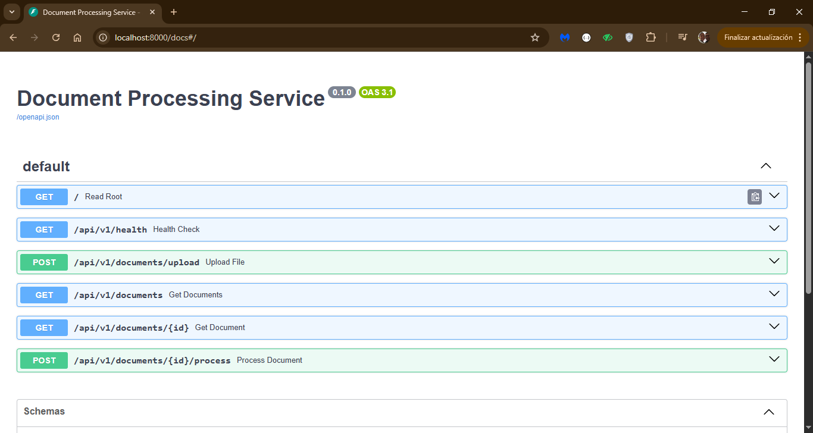
</p>


### Gestión de Errores y Estados

El servicio utiliza códigos de estado HTTP estandarizados para una integración consistente:

|Código|Razón|Acción de Auditoría|
|:---|:---|:---|
|201| Created|Carga exitosa|DOCUMENT_UPLOADED|
|200| OK|Procesamiento exitoso|DOCUMENT_PROCESSED|
|409| Conflict|Documento duplicado|DUPLICATE_UPLOAD_ATTEMPT|
|413| Entity Too Large|Excede los 10MB|Log de seguridad interno|
|503| Service Unavailable|Base de datos caída|Reportado por Health Check|

### Ejecución de Pruebas

Para garantizar la integridad del código, puedes ejecutar la suite de pruebas unitarias e integración directamente dentro del contenedor de la aplicación.

Usa el siguiente comando desde la raíz del proyecto `service-doc-proc`:

```bash
docker exec -it doc_processor_app pytest tests/test_main.py
```

El sistema cuenta con una suite de pruebas automatizadas con Pytest que validan el flujo de seguridad. Las pruebas confirman que el acceso a los recursos está protegido y que solo las peticiones con una API Key válida pueden interactuar con el procesador de documentos.

<p align="center">
  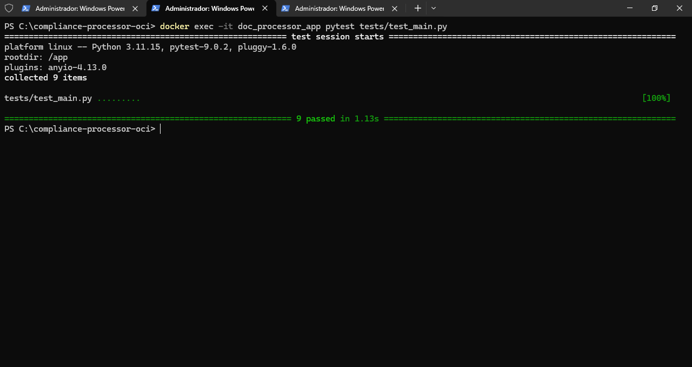
</p>

### Observaciones y Justificaciones de Diseño

- **Patrón Adapter**: Se ha implementado el Patrón Adapter en los clientes de base de datos (app/database.py para SQL y app/internal/mongodb.py para NoSQL). Esto permite que, si en el futuro se decide cambiar SQLAlchemy o el driver de Mongo, la lógica de negocio en main.py permanezca inalterada, modificando únicamente la implementación del adaptador.

- **Organización DDD**: Se ha considerado una estructura basada en DDD (Domain-Driven Design), pero dado el tamaño y alcance actual de este servicio único, se ha optado por una estructura modular más ligera para evitar sobreingeniería, priorizando la claridad y la rapidez de desarrollo.


### Demostración de Trazabilidad End-to-End

Para garantizar la integridad de los datos, el sistema sincroniza cada carga en tres capas distintas utilizando un identificador único (UUID).

1. Carga mediante API (FastAPI)

El endpoint /upload procesa el archivo, lo sube a la infraestructura de almacenamiento y retorna los metadatos unificados.

<p align="center">
  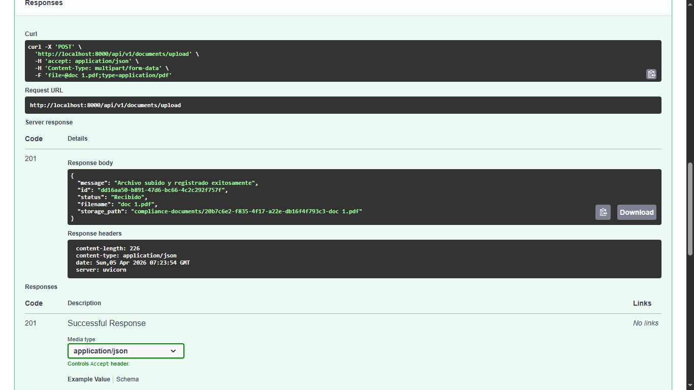
</p>


2. Persistencia Relacional (PostgreSQL)

Se registra la metadata principal y la ruta lógica del archivo para consultas rápidas y gestión de estados.

<p align="center">
  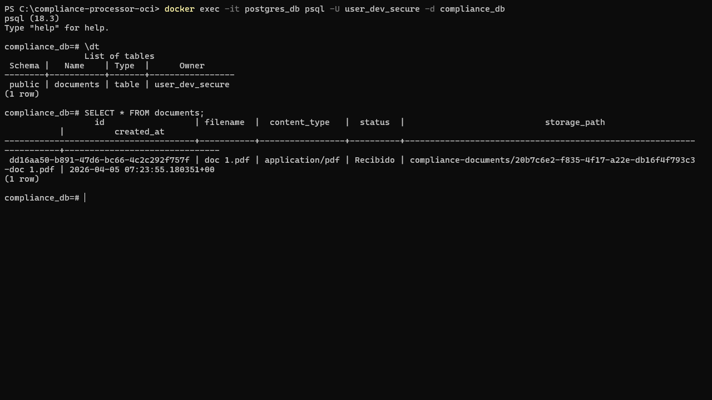
</p>

3. Auditoría Documental (MongoDB)
Cada evento se registra de forma inmutable para fines de cumplimiento y auditoría, almacenando el contexto del evento.

<p align="center">
  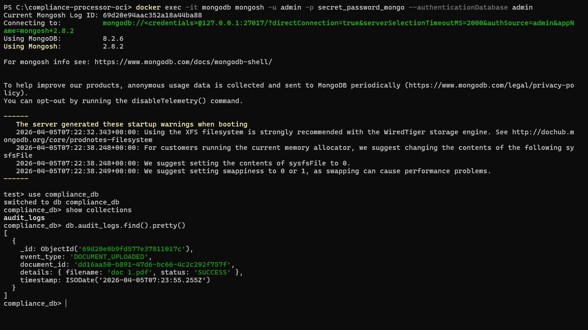
</p>

4. Almacenamiento de Objetos (MinIO)
El archivo físico se almacena de forma segura conservando la estructura de carpetas definida por el storage_path.

<p align="center">
  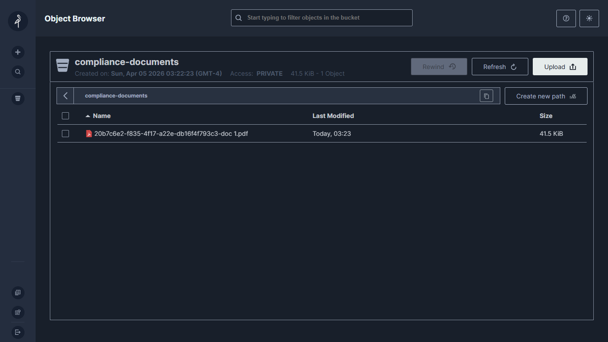
</p>

## Pruebas de Integración (BFF + Core)

Para validar la comunicación entre el BFF (Node.js) y el Core (FastAPI), se realizaron pruebas de flujo completo utilizando Insomnia.

1. Disponibilidad del Sistema (Health Check)

Se verifica que ambos microservicios estén sincronizados y que las bases de datos (PostgreSQL, MongoDB) y el almacenamiento (MinIO) estén operativos.

Endpoint: GET /api/v1/health

<p align="center">
  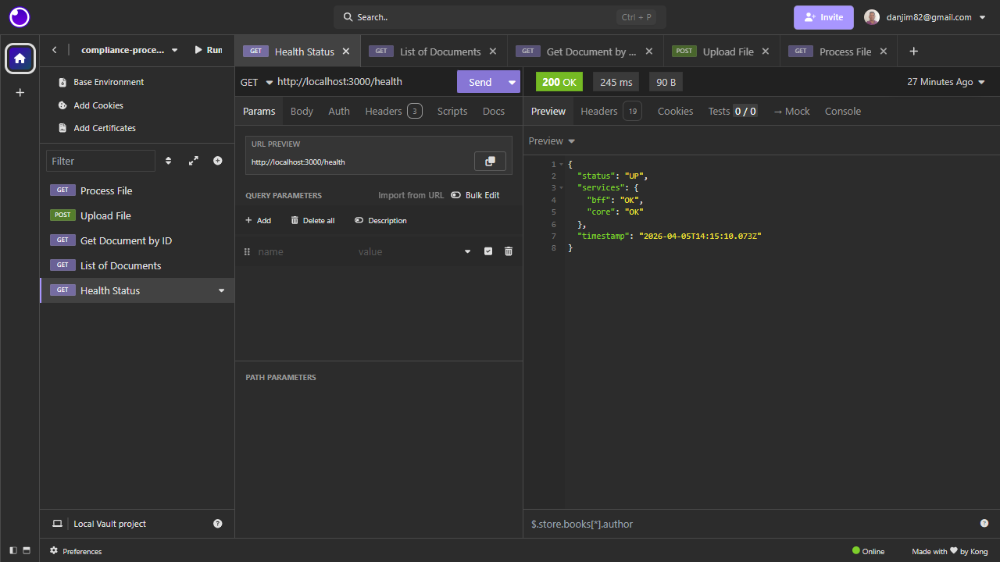
</p>

2. Carga de Documentos (Multipart Form)

Validación de la subida de binarios mediante Multer en el BFF y transmisión hacia el Core.

Endpoint: POST /api/v1/documents/upload

Resultado: Generación de UUID y persistencia en storage.

<p align="center">
  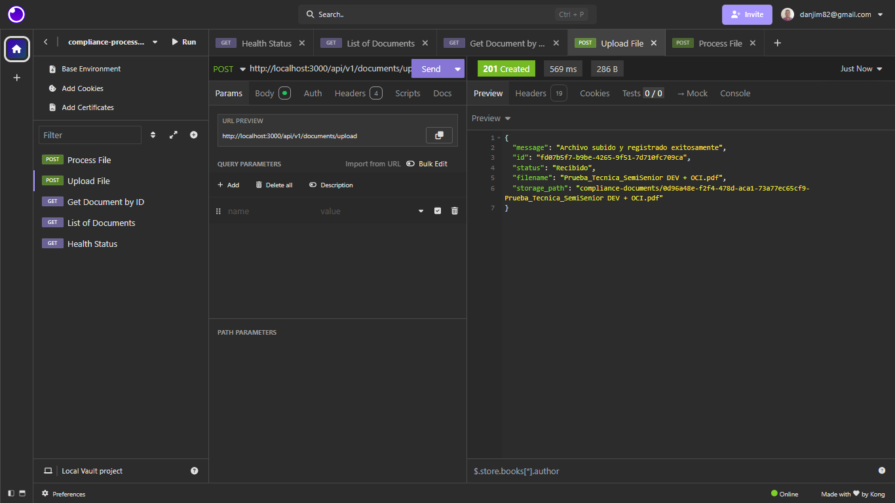
</p>

3. Procesamiento de Información

Disparo del motor de procesamiento sobre un documento ya existente.

Endpoint: POST /api/v1/documents/:id/process

Resultado: Cambio de estado a PROCESSED y registro en log de auditoría.

<p align="center">
  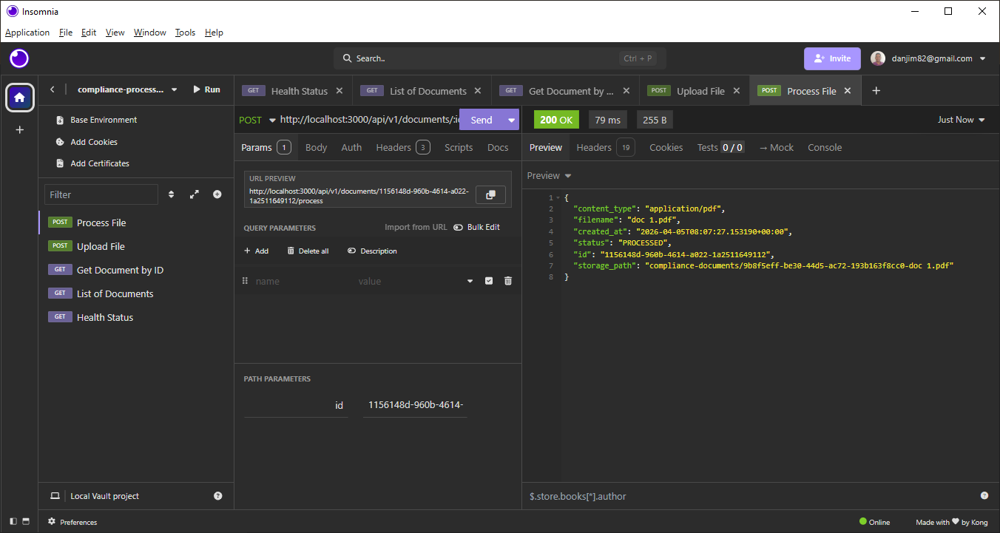
</p>

4. Consulta de metadatos por ID

Recupera la información detallada de un registro específico mediante su identificador único (UUID).

Endpoint: GET /api/v1/documents/:id

<p align="center">
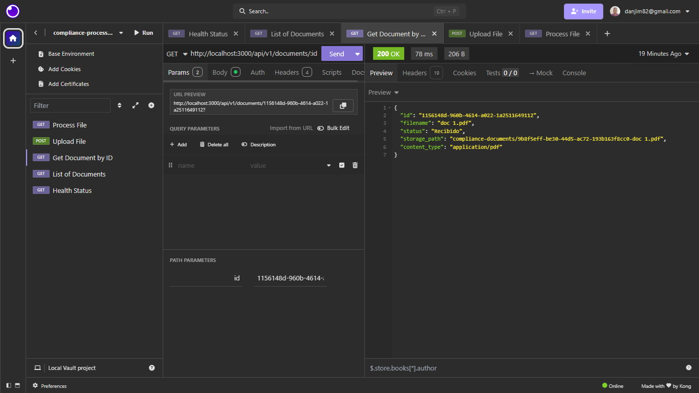
</p>

5. Listado de colección con paginación

Permite la visualización de todos los documentos cargados en el sistema con soporte para límites de registros por página.

Endpoint: GET /api/v1/documents

<p align="center">
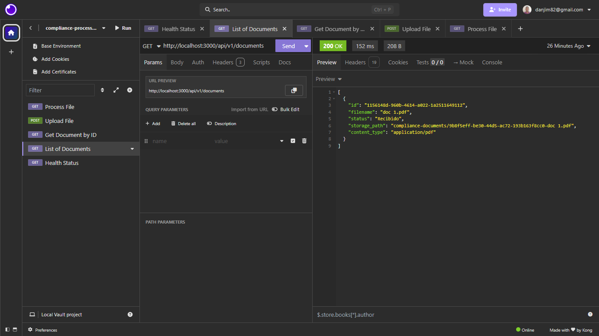
</p>

### Seguridad y Configuración (12-Factor App)

El proyecto sigue los principios de Twelve-Factor App, específicamente en la gestión de configuraciones y seguridad:

- **Configuración por Entorno:** Toda la sensibilidad (API Keys, credenciales de MinIO, URIs de bases de datos) se gestiona mediante variables de entorno (`.env`), permitiendo que el código sea agnóstico al entorno de ejecución.

- **Seguridad S2S (Service-to-Service):** Se implementó un "Handshake" de seguridad entre el BFF y el Core. Todas las peticiones internas requieren el header `X-API-KEY`. Esto asegura que el procesador de documentos solo acepte peticiones legítimas del BFF.

### Flujo de Notificaciones en Tiempo Real

Para ofrecer una experiencia de usuario fluida, el sistema utiliza un modelo de comunicación reactivo:

- **Acción:** El usuario inicia el procesamiento de un documento.

- **Backend**: El Core procesa el archivo y, al finalizar, dispara un Webhook hacia el BFF.

- **Frontend**: El BFF emite un evento vía Socket.io.

- **Resultado**: El cliente recibe la actualización instantáneamente sin necesidad de refrescar la página.

#### Evidencia de funcionamiento:

Paso 1: Solicitud de procesamiento exitosa desde el cliente API.

<p align="center">
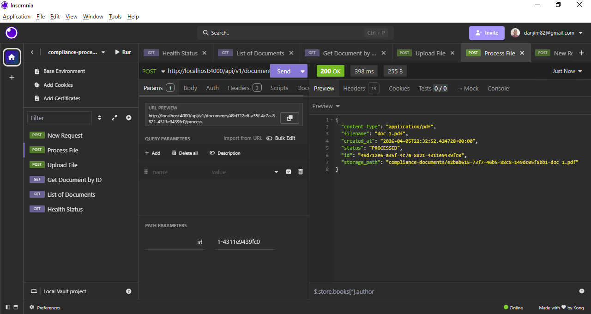
</p>

Paso 2: Recepción automática del evento en el cliente de prueba (Browser).

<p align="center">
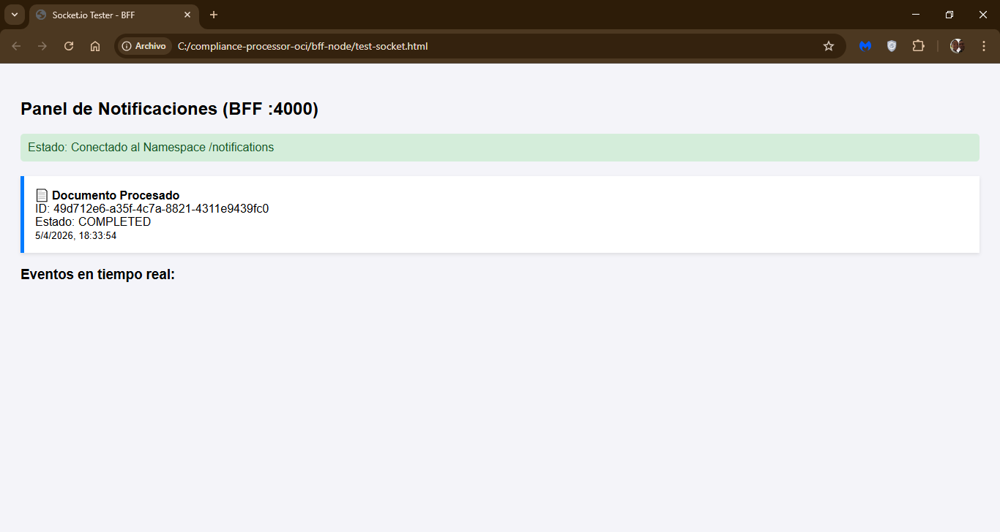
</p>

Nota: El archivo test-socket.html se incluye exclusivamente como Prueba de Concepto (PoC) para validar la conectividad de WebSockets antes de la integración total con el Frontend.

### Notas Técnicas de la Implementación

- **Orquestación:** El BFF actúa como un intermediario que valida la integridad de los datos antes de delegar la lógica de negocio al Core en Python.

- **Manejo de Binarios:** Se utiliza `Multer` para la gestión de archivos en memoria, optimizando la velocidad de transferencia hacia el almacenamiento persistente.

- **Tolerancia a Fallos:** El endpoint de `health` realiza un chequeo en cascada, validando tanto la disponibilidad del BFF como la conectividad de los servicios internos del Core.

## Integración Continua (CI)

Se ha implementado un pipeline de validación automatizada mediante GitHub Actions que actúa como el "guardián" de la calidad del código. Este flujo garantiza que cualquier cambio propuesto en la rama main sea funcional y seguro antes de ser integrado.

### Flujo de Validación Automatizada

Cada vez que se realiza un `push` o un `Pull Request` hacia la rama principal, el sistema dispara un flujo de trabajo en un entorno efímero de Linux que recrea la infraestructura completa:

- **Aislamiento de Entorno:** Se levanta la arquitectura completa (PostgreSQL, MongoDB, MinIO y el Document Processor) utilizando Docker Compose dentro del Runner de GitHub.

- **Inyección Dinámica de Secretos:** Gestión segura de credenciales mediante GitHub Actions Secrets, evitando la exposición de API Keys o contraseñas de bases de datos.

- **Validación de Salud (Health Checks):** El pipeline espera activamente a que todos los servicios internos reporten un estado `healthy` antes de proceder, asegurando que no haya errores de conectividad.

- **Suite de Pruebas de Integración:** Ejecución de pytest directamente dentro del contenedor del microservicio para validar:

  - Autenticación S2S (X-API-KEY).

  - Persistencia real en las tres capas (SQL, NoSQL, S3).

  - Lógica de negocio y manejo de excepciones.

### Arquitectura del Pipeline

1. **Build:** Construcción de las imágenes de Docker del BFF y el Core.

2. **Provision:** Despliegue de contenedores de infraestructura (Postgres, Mongo, MinIO).

3. **Wait & Check:** Verificación de disponibilidad de servicios.

4. **Test:** Ejecución de tests de integración y linters.

### Evidencia de Pipeline Exitoso

El cumplimiento de los estándares de código y la integridad de la infraestructura se visualizan directamente en la pestaña de Actions de GitHub:

<p align="center">
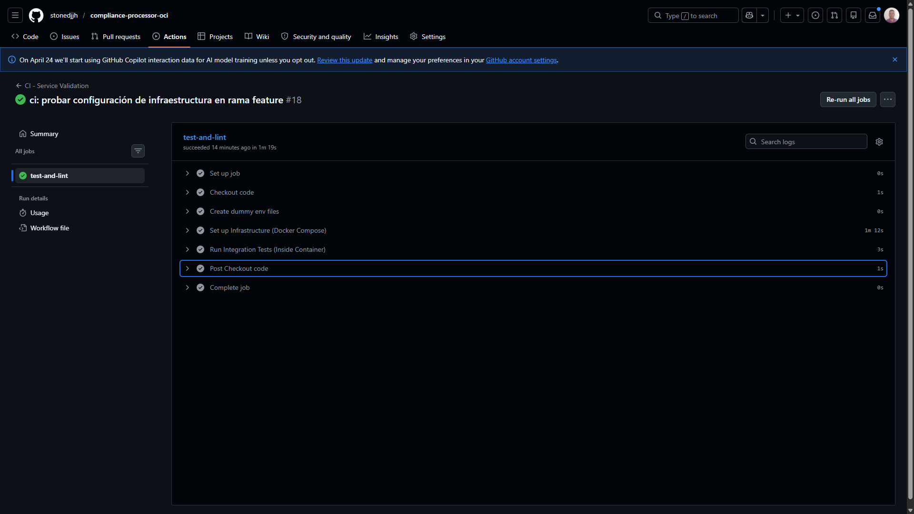
</p>

[!NOTE]
Estado del Despliegue (CD): Actualmente el flujo está enfocado exclusivamente en Integración Continua (CI). El despliegue a los compartimentos de Oracle Cloud Infrastructure (OCI) se mantiene como una fase manual controlada para asegurar la revisión humana de los reportes de cumplimiento generados por los tests.

## Frontend - Dashboard de Monitoreo (React + TypeScript)

La interfaz de usuario ha sido diseñada como un Single Page Application (SPA) reactivo, priorizando la observabilidad de los estados de cumplimiento en tiempo real.

### Tecnologías Clave

- **Vite:** Para un entorno de desarrollo ultrarrápido y builds optimizados.

- **Socket.io-client:** Gestión de la conexión persistente con el BFF para actualizaciones "push".

- **CSS Modules:** Estilo encapsulado por componente para evitar fugas de estilos y colisiones.

- **Axios:** Cliente HTTP configurado con interceptores para la comunicación con el API Gateway (BFF).

### Características Técnicas

- **Arquitectura Basada en Hooks:** Se implementó un hook personalizado useSocket y un SocketProvider (Context API) para centralizar la conexión. Esto garantiza que cualquier componente de la aplicación pueda reaccionar a eventos del servidor sin duplicar conexiones.

- **Gestión de Estados Reactiva:** La tabla de documentos no requiere recarga manual. Al recibir un evento document_processed vía Socket, el estado local se actualiza mediante un mapeo inmutable, transformando visualmente la fila de "Recibido" (Azul) a "Procesado" (Verde) al instante.

- **Feedback de Usuario (UX):** - Limpieza automática de formularios mediante useRef tras cargas exitosas.

  - Sistema de notificaciones temporales (`setTimeout`) para confirmaciones de carga y errores de validación.

  - Botones de acción contextuales que cambian según el estado del documento (Procesar vs. Ver Detalles).

### Flujo de Datos en el Cliente

- **Suscripción:** Al montar el componente DocumentTable, el cliente se suscribe al namespace de notificaciones del BFF.

- **Mutación Local:** Cuando se realiza un upload, la UI añade preventivamente el registro con el UUID retornado por el Core.

- **Sincronización Asíncrona:** Una vez que el motor de Python termina el análisis, el componente recibe el payload de actualización y actualiza únicamente la celda de estado.

### Scripts de Desarrollo

Desde la carpeta `frontend-react/`:

```bash
# Instalar dependencias
npm install

# Levantar entorno de desarrollo (Vite)
npm run dev

# Construir para producción (Genera carpeta /dist)
npm run build
```

##  Guía de Inicio Rápido (Local)

Siga estos pasos para levantar el ecosistema completo en su máquina local utilizando Docker. El sistema configurará automáticamente las redes internas y volúmenes de persistencia.

### 1. Clonar el Repositorio

```bash
git clone https://github.com/stonedjjh/compliance-processor-oci.git
cd compliance-processor-oci
```

### 2. Configuración de Variables de Entorno

El proyecto utiliza una arquitectura de 12-factor app. Debe configurar los archivos .env en tres niveles (puede usar los archivos .env.example como base):

1. **Raíz del proyecto:** Configure el archivo .env para la orquestación de bases de datos y almacenamiento.

2. **BFF (/bff-node):** Configure el .env con las credenciales para conectar con el Core Service y configurar Socket.io.

3. **Frontend (/frontend-react):** Configure el .env con la URL del BFF (VITE_API_URL).

```bash 
# Ejemplo rápido para copiar los archivos de ejemplo (en sistemas Unix/WSL)
cp .env.example .env
cp bff-node/.env.example bff-node/.env
cp frontend-react/.env.example frontend-react/.env
```

> [!TIP]
> Asegúrese de que el API_KEY_SECRET sea idéntico en el .env de la raíz y del BFF para que el Handshake de seguridad funcione.

### 3. Ejecución con Docker Compose

Desde la raíz del proyecto, ejecute el siguiente comando. Docker construirá las imágenes del frontend (Multi-stage con Nginx), el BFF (Node.js) y el Core (FastAPI).

```bash 
docker-compose up --build
```

### Seguridad y Acceso a Herramientas

Para alinearse con las mejores prácticas de **Cloud Security**, los puertos de administración directa están expuestos pero comentados en el archivo `docker-compose.yml`. Esto simula un entorno donde el acceso a la infraestructura solo se permite mediante canales seguros.

- **MinIO Console (Visualizador de S3)**: Permite verificar la persistencia física de los archivos. Para acceder, busque la sección de `minio` en el compose y descomente el mapeo del puerto `9001:9001`.
- **Swagger UI (Documentación Core)**: Facilita la prueba manual de los endpoints del microservicio de Python. Para acceder, descomente el puerto `8000:8000` en el servicio `core-proc`.

Una vez habilitados, podrá acceder en:
- **MinIO**: `http://localhost:9001`
- **Swagger**: `http://localhost:8000/docs`

---

### Validación Estricta de Documentos (Security-First)

Aunque no se especificó en los requerimientos iniciales, se ha implementado una capa de validación de integridad en el punto de entrada de `main.py` para prevenir la carga de archivos maliciosos o no deseados.

Actualmente, el sistema solo acepta extensiones de uso administrativo:

```python
# Ubicación: main.py
validate_file_upload(content, filename, allowed_extensions=[".pdf", ".docx"])
```

**¿Cómo modificar la política de validación?:**

Si desea flexibilizar o restringir aún más los tipos de archivos permitidos, puede modificar el parámetro `allowed_extensions`:

1. Permitir todos los tipos: Cambie el valor a `["*"]`. El validador interpretará el comodín y omitirá la restricción de extensión.

2. Agregar nuevos tipos: Simplemente añada la extensión al array (ej. `[".pdf", ".docx", ".jpg"]`).

> [!NOTE]
> Cualquier archivo que no cumpla con esta lista blanca devolverá un código **400 Bad Request**, protegiendo el almacenamiento de objetos de datos no procesables.

## Estructura del Proyecto

```text
compliance-processor-oci/
├── service-doc-proc/
│   ├── app/
│   │   ├── internal/
│   │   │   └── config.py     # Gestión de variables de entorno y configuración centralizada 
│   │   │   └── database.py   # SQLAlchemy, Sesiones y Health Check SQL
│   │   │   └── models.py     # Modelos relacionales (PostgreSQL)
│   │   │   └── mongodb.py    # Cliente NoSQL asíncrono (Motor) y auditoría
│   │   └── utils/
│   │   │   └── notifier.py    # Lógica de notificación de eventos en tiempo real.
│   │   │   └── storage.py     # Lógica de interacción con MinIO/S3 (StorageManager)
│   │   │   └── validators.py  # Validación de archivos (SRP)
│   │   ├── main.py            # Endpoints, lógica de negocio y Health Checks
│   │   ├── schemas.py         # Definición de modelos para validación de entrada/salida (DTOs)
│   ├── tests/
│   │   ├── conftest.py        # Fixtures y mocks de entorno
│   │   └── test_main.py       # Pruebas unitarias e integración
│   └── .dockerignore          # Exclusión de archivos para construcción de la imagen de Python
│   └── Dockerfile             # Definición de la imagen base y pasos de despliegue 
│   └── requirements.txt       # Lista de dependencias del proyecto Python
├── bff-node/
│   ├── src/
│   │   ├── adapters/
│   │   │   └── document.adapter.ts      # Cliente Axios para comunicación con el Core Service
│   │   │── controller/
│   │   │   └── document.controllers.ts  # Orquestación de peticiones y manejo de respuestas 
│   │   ├── middlewares/
│   │   │── routes/
│   │   │   └── document.routes.ts # Definición de rutas y vinculación con controladores
│   │   │── types/
│   │   │   └── pagination.types.ts # Interfaces y tipos compartidos
│   │   ├── index.ts  # Punto de entrada de la aplicación y configuración del servidor Express
│   ├── .env/         # Variables de entorno específicas para el entorno de ejecución Node.js
│   ├── Dockerfile    # Definición de la imagen base y pasos de despliegue para el BFF
│   ├── package.json  # Manifiesto de dependencias y scripts de ejecución de Node.js
│   ├── tsconfig.json # Reglas de compilación y configuración de tipos de TypeScript
├── frontend-react/
│   ├── public/       # Activos estáticos accesibles directamente por el navegador
│   ├── src/ 
│   │   ├── api/
│   │   │   └── axios.config.ts  # Configuración base de Axios e interceptores de peticiones
│   │   │   └── documentApi.ts   # Definición de servicios para interactuar con los endpoints 
│   │   ├── assets/              # Recursos multimedia (imágenes, iconos, fuentes)
│   │   ├── components/
│   │   │   ├──DocumentTable      # Tabla reactiva con actualización de estados vía Sockets
│   │   │   ├  └── DocumentTable.module.css
│   │   │   ├  └── DocumentTable.tsx
│   │   │   ├──NavBar             # Navegación superior y branding de la plataforma
│   │   │   ├  └── NavBar.module.css
│   │   │   ├  └── UploadBox.tsx
│   │   │   ├──UploadBox          # Zona de carga con validaciones y manejo de UI (refs/timers)
│   │   │   ├  └── UploadBox.module.css
│   │   │   ├  └── UploadBox.tsx
│   │   ├── context/
│   │   │   └── SocketContext.tsx # Proveedor global para la instancia de Socket.io 
│   │   ├── hook/
│   │   │   └── useSocket.tsx # Hook personalizado para suscripción a eventos en tiempo real
│   │   ├── type/
│   │   │   └── document.ts      # Interfaces de TypeScript para el dominio de Documentos
│   │   │   └── socket.ts        # Tipado de eventos y payloads de comunicación en tiempo real
│   │   ├── App.css              # Estilos globales y variables de diseño (tokens)
│   │   ├── App.tsx              # Componente raíz y orquestador de la disposición (layout)
│   │   ├── index.tsx
│   │   ├── main.tsx             # Punto de entrada de React y configuración del DOM virtual
│   ├── .env
├── .env              # Variables de entorno globales para la orquestación del proyecto
├── .gitignore        # Exclusión de archivos para el control de versiones de Git
├── docker-compose.yml  # Orquestación de contenedores (BFF, Core, DBs y Storage)
```    

## Próximos Pasos (Planificación Incremental)

- **Seguridad End-to-End:** Implementar autenticación JWT para proteger las rutas del BFF y persistir la sesión en el Frontend.

- **Gestión de Usuarios:** Creación de pantalla de registro e inicio de sesión utilizando `react-hook-form`y validaciones de esquema con `Zod`.

- **Paginación Real (Full-Stack):** Aunque el API Core ya soporta los parámetros `skip` y `limit`, falta implementar los controles de navegación (Siguiente/Anterior) en la UI para optimizar la carga de grandes volúmenes de datos.

- **Optimización de Reactividad:** Sincronización automática de la `DocumentTable` inmediatamente después del evento de carga (Upload), eliminando la necesidad de refresco manual.

- **Feedback Enriquecido:** Implementación de mensajes más explícitos desde el BFF al Frontend (Toast notifications) para reportar estados de validación detallados.

- **Interoperabilidad Legacy:** Integración de servicios externos mediante **Flask** y **SOAP** para validaciones de cumplimiento de terceros.

- **Calidad de Código y Documentación:** - Cobertura de pruebas unitarias para la integración entre el BFF y React.

  - Inclusión de `docstrings` bajo el estándar Google/Numpy en todos los módulos de Python y Node.js para facilitar el mantenimiento.

- **Integridad de Datos:** Implementación de hashing SHA-256 para la detección de documentos duplicados antes del almacenamiento en MinIO.